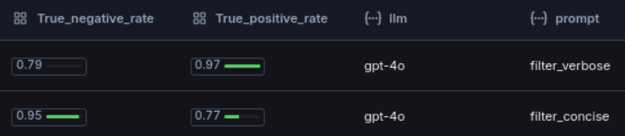
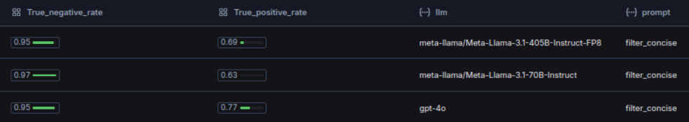

# Refining AI News Filters: A LangSmith Case Study with ML Times

Refining your LLM application is important — whether it’s updating the prompt, changing the backend LLM model to [opensource](https://docs.lambdalabs.com/on-demand-cloud/using-the-lambda-chat-completions-api), or making other adjustments. In this case study we explore how a centralized evaluation platform plays a crucial role in refining your applications. We will go over how to use [LangSmith](https://www.langchain.com/langsmith) to improve the news filter for a specific website called [ML Times](https://news.lambdalabs.com/). These methods can also be applied to other platforms (e.g. [LangFuse](https://langfuse.com/faq/all/langsmith-alternative)) and applications.

The key takeaways are:
* __Centralized Performance Tracking__: Using a platform like LangSmith to monitor your LLM application's performance is crucial.
* __Efficient Evaluation Processes__: Streamlined, data-driven evaluation processes effectively improve prompt engineering and model comparison.

## [ML Times](https://news.lambdalabs.com/)

Let's begin with some context about our application, [ML Times](https://news.lambdalabs.com/news/today) — a news website that aggregates AI/ML articles from social media and research blogs, specifically tailored for _seasoned Machine Learning Engineers and Researchers_. To prevent information overload, an LLM agent filters out irrelevant content. Here’s how the workflow operates:

```
   +-------------------------------+
   |           Inputs:             |
   |  <title>, <summary>           |
   +-------------------------------+
                     |
                     v
   +--------------------------------------------+
   |          Formed Prompt:                    |
   |  """                                       |
   |  Is this article relevant?                 |
   |  The article: {title} {summary}            |
   |  """                                       |
   +--------------------------------------------+
                     |
                     v
   +--------------------------------------------+
   |           LLM Agent response:              |
   |       relevant: <true / false>             |
   |       comment: <explanation/comment>       |
   +--------------------------------------------+
                     |
                     v
   +--------------------------------------------+
   |            Output Parser:                  |
   |        Returns: <true / false>             |
   +--------------------------------------------+
```
*The filtering chain is passed a news article title and summary and is tasked with classifying it as relevant or irrelevant for the target audience of machine learning professionals. Then, If an article is deemed relevant by the agent, it will be displayed on the website, else it will be discarded.*


## Experiments

The prompt and the backend LLM model are two of the most frequently iterated components in any LLM-based application. We'll demonstrate how evaluation aids in understanding their performance and make informed design choices.

### Prompt engineering: *"how verbose should I make the prompt?"*

**Insight: The more concise prompt produces stricter filtering decisions**

Two prompts, namely `filter_concise` and `filter_verbose`, are evaluated. The `filter_concise` prompt is more concise and direct, while the `filter_verbose` prompt provides additional context and instructions to the LLM agent. This difference is evident in the `true positive rate` (TPR) and `true negative rate` (TNR): `filter_concise` is stricter than `filter_verbose` as reflected in their respective TPR and TNR metrics.

*comparison of prompts classification performance*  


For [ML Times](https://news.lambdalabs.com/news/today), blocking irrelevant articles is a higher priority than correctly labeling all relevant ones. Thus, we prioritize the `true_negative_rate` over the `true_positive_rate`, leading to the deployment of `filter_concise` in production.

### Model evaluation: *"Which model should I use for my application?"*

**Insight: llama 3.1 70B, llama 3.1 405B have a similar filtering performance and are both slightly less accurate on relevant examples than gpt-4o**

All models featured similar TNR of >= 95%. However, GPT-4o is more accurate than the llama 3.1 models on TPR. We also noticed that larger models tend to outperform smaller models.

*comparison of models classification performance*  


## Implementation Details

The rest of the article will walkthough implmentation details. You can find our opensource implementation in [this repo](https://github.com/LambdaLabsML/langsmith-experiments).

**Repository organization**
```
langsmith-experiments/        # root directory
├── utils/
│   ├── evaluators.py         # langsmith evaluator methods
│   ├── export_datasets.py    # script to export datasets to langsmith
│   └── export_prompts.py     # script to export prompts to langsmith
├── dataset.csv               # example datasets to export to LangSmith
└── experiment.py             # run evaluation of LLM filter against the example dataset
```


**Authentications**

You need a LangSmith account and an LangSmith [API key](https://docs.smith.langchain.com/how_to_guides/setup/create_account_api_key).

You will also need to have access to LLM APIs, such as [OpenAI API](https://platform.openai.com/docs/api-reference/authentication). Opensource models usually require [self-hosting](https://docs.lambdalabs.com/on-demand-cloud/how-to-serve-the-llama-3.1-8b-and-70b-models-using-lambda-cloud-on-demand-instances) or APIs hosted by third-party providers -- for example, via the [Lamdba Chat Completion API](https://docs.lambdalabs.com/on-demand-cloud/using-the-lambda-chat-completions-api).

We organize OAuth using the following files in the root directory of the project:

`.langsmith-env`
```
LANGCHAIN_TRACING_V2=true
LANGCHAIN_ENDPOINT=https://api.smith.langchain.com
LANGCHAIN_API_KEY=<your langsmith api key>
```

`.env-llm.json`
```
[
    {
        "model_name": "gpt-4o",
        "url": "https://api.openai.com/v1",
        "api_key": <your openai API key>
    },
    {
        "model_name": <opensource model name> # for example, hermes-3-llama-3.1-405b-fp8,
        "url": <inference endpoint url>, # for example "https://api.lambdalabs.com/v1"
        "api_key": <your API key for the inference endpoint> # for example "EMPTY"
    },
    ... # add more llm endoints here as needed
]
```


**Dependencies**
```bash
pip install langsmith langchain langchain-openai
```

**Datasets**

Our dataset is stored as a CSV file (`dataset.csv`) with the following columns:
* `title` : title of the article which goes into the prompt
* `summary` : summary of the article which goes into the prompt
* `relevant` : the example output ground truth label, either `0` if article is irrelevant or `1` if relevant.

`dataset.csv` should be exported to langsmith. You can export manually using the [LangSmith UI](https://docs.smith.langchain.com/old/evaluation/faq/manage-datasets#upload-a-csv), or programmatically with a script:
```bash
python3 utils/export_datasets.py
```

Our evaluation dataset contains 400 records directly sampled from articles processed by the ML Times filter during a five day period.
The annotation process was conducted by a team of 5 annotators tasked with evaluating whether of not they would enjoy reading the article on ML Times.
Of these records, 35 records are labelled relevant (8.75%) and 365 irrelevant (91.25%).

Here is an example of a positive record (ie *'relevant'*) in the dataset:
```
title: "AiOla open-sources ultra-fast 'multi-head' speech recognition model"

summary: """
- **AiOla has released Whisper-Medusa**, an open-source AI model that **integrates OpenAI's Whisper technology**, enhancing speech recognition speed by **50% without compromising accuracy**.
- The **speed improvement** is achieved by predicting ten tokens at a time instead of one, a method that significantly **reduces generation runtime for long-form audio**.
- **Whisper-Medusa's model weights and code are publicly available** on [GitHub](https://github.com/aiola-lab/whisper-medusa), with plans to introduce a **20-head version** maintaining equivalent accuracy, leveraging a **multi-head attention architecture** for training."""
```

Here is an example of a negatve negative record (ie *'not relevant'*) record in the dataset:
```
title: "KCL, a constraint-based functional language for configuration"

summary: """
- **KCL is an open-source, constraint-based functional language** designed for configuration and policy scenarios, drawing inspiration from Python and Golang.
- It offers **schema-centric configuration types, modular abstraction, and a static type system** for stability and scalability in cloud-native environments.
- **KCL integrates with major cloud-native projects** like Kubernetes, providing tools for IDEs, SDKs, and automation with a focus on configuration stability and scalability. [Learn More](https://www.kcl-lang.io/docs/user_docs/getting-started/intro)"""
```

**Prompts**

Here are the two prompts used in our experiments:

`filter_concise`:
```
You are an evaluator tasked with assessing if an article match a set of criteria based on its Summary.

[begin Summary]
{title}
{summary}
[end Summary]

The reader is a seasoned Machine Learning Engineer and Researcher.
Score the potential impact of the news article on their job from 1 to 3.
News that significantly affects the job of the reader includes critical new research findings, product releases, or major industry developments. 

Example response:
{{"relevant": <score from 1 to 3>, "comment": "<your explanation here>"}}

Response:
```

`filter_verbose`:
```
Keep these instructions open and refer to them as often as you need during the assessment.

You are tasked with assessing the impact of the news article on a seasoned Machine Learning Engineer and Researcher.

News that significantly affects the job of the reader includes critical new research findings, product releases, or major industry developments.

News that moderately affects the job of the reader includes items that are somewhat relevant but not critically important to the seasoned Machine Learning reader.

Your response will provide a comment describing your assessment followed by a score from 1 to 3.

Score of 3 is for information that is highly likely to impact the reader.
Score of 2 is for information that moderately likely to impact the reader.
Score of 1 is for information that is unlikely to impact the reader.

[begin Summary]
{title}
{summary}
[end Summary]

The response should be JSON formatted and include:
* a "comment" key with a short explanation about your evaluation.
* a "relevant" key with a score from 1 to 3

Example:
{{"comment": "<your explanation here>", "relevant": <score from 1 to 3>}}


Response:
```

Some additional notes:
* The two prompts differ in their verbosity. The goal is to see if the additional instructions in `prompt_verbose` help the LLM based classifier make better filtering decisions.
* The `relevant` field is the only field used by the application to drive the filtering decision in the application. The `comment` field is included in the response as additional context to understand the filtering decision when evaluating the filter.
* The score in the `relevant` field is a value from 1 to 3, instead of a binary value (eg `is relevant` / `is not relevant`) so I can set the relevance threshold in a fine-grained manner later; for example:
```
is_relevant = score >= 2 # looser definition of relevance
is_relevant = score == 3 # stricter definition of relevance
```

The easiest way to get started experimenting with your own prompts is to use [the langsmith UI](https://docs.smith.langchain.com/how_to_guides/prompts/create_a_prompt). Can also export prompts programmingly with a script:

```python
python3 utils/export_prompts.py
```

**Evaluators**

Evaluators are functions in LangSmith that score how well an LLM agent performs on a particular example (cf [langsmith docs](https://docs.smith.langchain.com/concepts/evaluation)). Our evaluators score the `accuracy`, the `true_positive_rate`, and the `true_negative_rate` of the filters.

`utils/evaluators.py`
```python
from langsmith.evaluation import EvaluationResult
from langsmith.evaluation import run_evaluator

@run_evaluator
def exact_match(run, example):
    prediction = int(run.outputs.get("relevant"))
    target = int(example.outputs.get("relevant"))
    match = prediction == target
    return EvaluationResult(key="accuracy", score=match)


def true_positive_rate(runs, examples):
    true_positives = 0
    actual_positives = 0
    for run, example in zip(runs, examples):
        reference = int(example.outputs.get("relevant"))
        prediction = int(run.outputs.get("relevant"))
        
        if reference == 1:
            actual_positives += 1
            if prediction == reference:
                true_positives += 1
    
    if actual_positives == 0:
        return

    score = true_positives / actual_positives
    return EvaluationResult(key="true_positive_rate", score=score)

def true_negative_rate(runs, examples):
    true_negatives = 0
    actual_negatives = 0
    for run, example in zip(runs, examples):
        reference = int(example.outputs.get("relevant"))
        prediction = int(run.outputs.get("relevant"))
        
        if reference == 0:
            actual_negatives += 1
            if prediction == 0:
                true_negatives += 1

    if actual_negatives == 0:
        return

    score = true_negatives / actual_negatives
    return EvaluationResult(key="true_negative_rate", score=score)
```

Note that the accuracy is measured using a [*run evaluator*](https://docs.smith.langchain.com/old/evaluation/faq/custom-evaluators#run-evaluators), `exact_match`, which compares the predicted output of the agent with the ground truth output and return a score for each individual run. These scores are then aggregated into the `accuracy` score. On the other hand, `true_positive_rate` and `true_negative_rate` are [*summary evaluator*](https://docs.smith.langchain.com/old/evaluation/faq/custom-evaluators#summary-evaluators) which return the overall score for the entire dataset directly.


**Put Things Together**

The `experiment.py` script launch experiment across different prompts, LLM models and datasets.

```python
# Set env variables
from dotenv import load_dotenv
load_dotenv(".env-langsmith")

# Load models backends
import json
models = json.load(open(".env-llm.json"))

# Define prompts and dataset
prompt_names = ["filter_concise", "filter_verbose"]
datasets = ["article_filter_a", "article_filter_b", "article_filter_c"]

run_all_experiments(models, prompt_names, datasets)
```
where

```python
def run_all_experiments(models, prompts, datasets):
    for model in models:
        model_name = model["model_name"]
        model_client = ChatOpenAI(
            model=model_name,
            base_url= model["url"],
            api_key=model["api_key"],
            temperature=0.0)
        for dataset_name in datasets:
            for prompt_name in prompts:
                print("Experiment: ", model_name, prompt_name, dataset_name)
                run_experiment(model_client, prompt_name, dataset_name)
```

## Conclusion
Using LangSmith for evaluating LLM applications, as demonstrated with [ML Times](https://news.lambdalabs.com/news/today), highlights the importance of a centralized evaluation platform. It enables effective prompt engineering and model comparison, helping developers make informed design choices to optimize performance. By prioritizing relevant metrics like the `true negative rate`, we were able to fine-tune [ML Times](https://news.lambdalabs.com/news/today)'s news filter to better serve specific user needs, and ensure the most effective model is deployed in production.